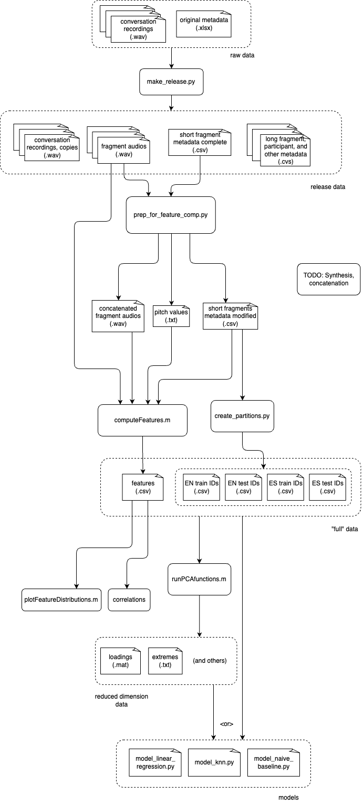

# DRAL-corpus

## Create a DRAL release from raw data

A DRAL release is created from conversation audios and their markup and metadata. See
the post-processing script's help message as well as its documentation: `make_release.py
--help`

After creating a release, optionally run (print stats script)

Archive the output for sharing. For example:

```zsh
cd "/Users/jon/Documents/DRAL-release"
tar -cvf "DRAL-6.0.tgz" "DRAL-6.0/"
# -c for "create", -v for "verbose", and -f for "location of archive"
```

```zsh
python make_release.py -i <path_to_input_directory> -o <path_to_output_directory>
```

### Create an incremental release

Compare files in a new release to a previous release with `diff`. To copy only new files
for a new release, copy the files of the new release into the previous release, select
"skip" for duplicate files, then in the previous release sort by Date Created.

### Specific to DRAL 8.0

For DRAL 8.0, run `add_partition_metadata_release_8.py`

#### Create LDC release from DRAL 8.0 release

1. Run `make_release_ldc.py`
2. (Optional) Run `validate-audio-files-ldc-release.sh`

## New release checklist

- Create a backup of the raw data from the shared OneDrive.
- Run the post-processing script.
- If the script raises warnings, fix them and re-run.
  - Fix the trouble markups in ELAN.
  - If there are markups with "DELETE" or similar note left by annotator, see
    instructions below to redact these segments.
- Review the metadata and compare to last release. Copy the new or updated files to
  create the new release. Do not copy the `-complete` CSV files, used for dissertation
  work.
- Add changes to the change log markdown file.
- Copy the change log markdown file to the release directory.
- Upload fixed annotation files and audio files to OneDrive, replacing the old ones.
- Archive the release. The `tar` command is in `DRAL-corpus/README.md`
- Upload the release to the shared OneDrive, copy to a flash drive to share later.

## Redact conversation audio

There has only been one request for redacting audio, so I haven't automated this
process. Below are instructions for redacting a single segment of conversation audio.
Adjust instructions if there are multiple segments.

- Open the markup file in ELAN, note the start time, end time, and duration of the
  segment to redact. This should have been annotated with "DELETE" or some other text.
- Rename both audio and markup files by appending `-before-redaction`
- Open the audio in Audacity to delete the segment
  - In the *Selection* area towards the bottom, enter the start time and end time
  - With the selection made, click *Edit* > *Delete*
  - Click *File* > *Export* > *Export as WAV*
  - Save the edited audio with the original filename
- Open the markup file in ELAN to adjust the markups
  - Click *File* > *Save As...* and save a new copy with the original filename
  - ELAN will automatically replace the audio with the edited version, since it looks
    for the original filename. Verify that the audio does not contain the redacted
    segment.
  - Select the annotation containing the segment to redact, then delete with
    *Annotation* > *Delete Annotation*.
  - Place the cursor/crosshair at the start time of the deleted annotation.
  - Click *Annotation* > *Shift* > *Annotation on All Tiers, Right of Crosshair...*,
    enter the duration of the deleted annotation in milliseconds as a negative duration.
    For example, if the duration was 00:00:05.200, enter `-5200`
  - Listen to a few annotated segments and verify they are intact
  - Save the file and close

## Print corpus statistics

Print corpus statistics -- such as the number of conversations, and utterances, their
duration, and the number of participants -- with `print_stats.py`.

```python
python print_stats.py --help
```

### Example output

```zsh
********** conversations **********
count (original) = 79
count (re-enacted) = 79
********** participants **********
count (unique) = 57
********** short fragments ("phrases") **********
count (original or re-enacted) = 4580
 EN count = 2290
 ES count = 2290
 JA count = 0
 BN count = 0
 FR count = 0
count (original) = 2290
count (re-enacted) = 2290
duration
 total = 0 days 03:18:31.034000
 mean = 0 days 00:00:02.600662445
 minimum = 0 days 00:00:00.150000
 maximum = 0 days 00:00:11.940000
********** long fragments ("re-enactments") **********
count (original or re-enacted) =  3610
 EN count = 1805
 ES count = 1652
 JA count = 49
 BN count = 65
 FR count = 39
count (original) = 1805
count (re-enacted) = 1805
duration
 total = 0 days 03:41:31.456000
 mean = 0 days 00:00:03.681843767
 minimum = 0 days 00:00:00.750000
 maximum = 0 days 00:00:22.783000
```

## Transcribe utterances

`transcribe_fragments.py` transcribes utterances with OpenAI Whisper pre-trained ASR
models. For English, using the large English-specific model. For Spanish, using the
large multilingual model. The script prints fragments with errors in their
transcription.

Most errors stem from mistakes in the markup, e.g. a silent utterance. Some utterances
are transcribed to text with characters not used in the language.
<!--
## Synthesize speech from transcribed utterances

### TODO

- [ ] Improve synthesis with tokenizing or pre-processing in some way before passing them to the Coqui TTS command.
- [ ] Many fragments had unusually long synthesized audio. I include the output of `synthesize_fragments.py` below.
- [ ] There might be transcription texts with strange characters I missed filtering out.
- [ ] I found that the pitch tracking (REAPER script) produced many NaNs. Likely because
  there are portions of pure silence. The number of reported pitch values was also less
  than expected, likely because the end of synthesized audios are pure silence and these
  do not get reported.
- [ ] Removing the NaNs clipped out the silent parts, but this clipped out the pauses
  between utterances in the same fragment.
- [ ] My solution was to add noise to the synthesized concatenated audios, in `utils/noise.py`.
-->
## Workflow diagram


