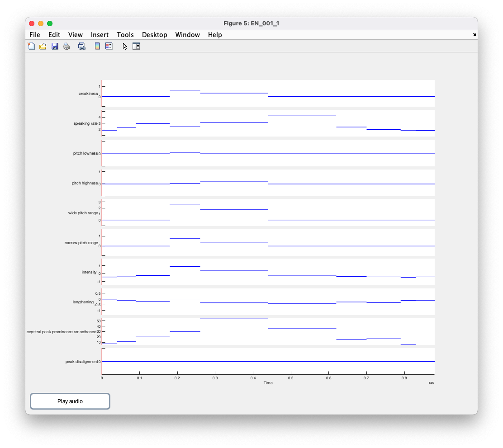

# feature-computation

This directory contains code for computing prosodic features
of DRAL utterances ("short fragments") using the Mid-level Toolkit.

To estimate the prosody similarity
of utterances, see [*Estimate the prosodic dissimilarity of utterances*](../modeling/).

## Compute prosodic features of DRAL utterances

1. Gather the DRAL data.
   - (Option 1) Download the latest DRAL release (see [*Download the DRAL corpus*](../README.md)).
   - (Option 2) Create a DRAL release from raw data (see [*Collect similar data following the DRAL protocol*](../README.md)).
2. Setup MATLAB and Python (see [*Setup*](../README.md)).
3. Prepare the data for feature computation by running the Python script `prep_for_feature_comp.py`. This script concatenates utterances into new audios, estimates pitch with REAPER, and modifies the corpus metadata.
4. Compute the features by running the MATLAB function `computeFeatures.m`. This script computes prosodic features using the Mid-level Toolkit and modified Mid-level Toolkit functions.

## Plot prosodic features in an interactive figure

To plot the prosodic features of a DRAL utterance, run the MATLAB function `plotFragFeatures.m`.

### Preview

## Test audio

See [./test-audio/README.md](./test-audio/README.md).

## Modifications to the Mid-level Toolkit

### Modified pitch computation

The script `lookUpOrComputePitchModified.m` is modified from Midlevel Toolkit `lookupOrComputePitch.m`. The function `lookUpOrComputePitchModified` removes the fallback to VOICEBOX `fxrapt` enforcing REAPER for pitch tracking.

For more information, see documentation in `lookUpOrComputePitchModified.m`.

### Modified CPPS computation

The script `computeCPPSmodified.m` is modified from Midlevel Toolkit `computeCPPS.m`. The function `computeCPPS` runs about 5 times faster by reducing the number of spectrogram windows computations (as tested by `timeCPPSfunctions.m`) and pads the return CPPS feature vector so that each 10 milliseconds of the input signal is assigned a CPPS value.

This modified function is unused; it did not have a strong correlation with the original function, as tested by `plotCPPSfunctions.m`.

### Interactive feature plot

The function `plotFeatures.m`, called by `plotFragFeatures.m` is generalized and can be used with other features computed outside of DRAL.

## Notes

I wanted to write all code in Python and use the MATLAB engine to call the Midlevel Toolkit functions I
needed, but not all Midlevel Toolkit functions can be called from Python because they return [unsupported
types](https://www.mathworks.com/help/matlab/matlab_external/passing-data-to-python.html#buialof-51).
