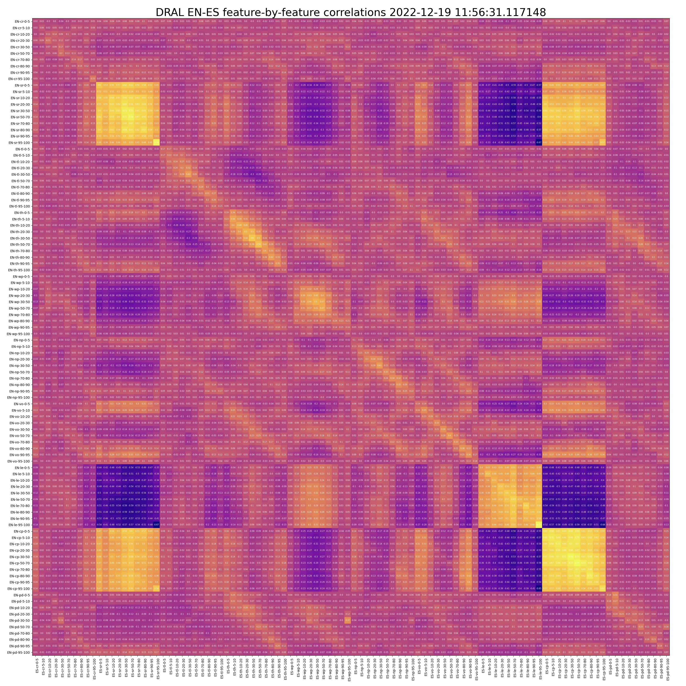
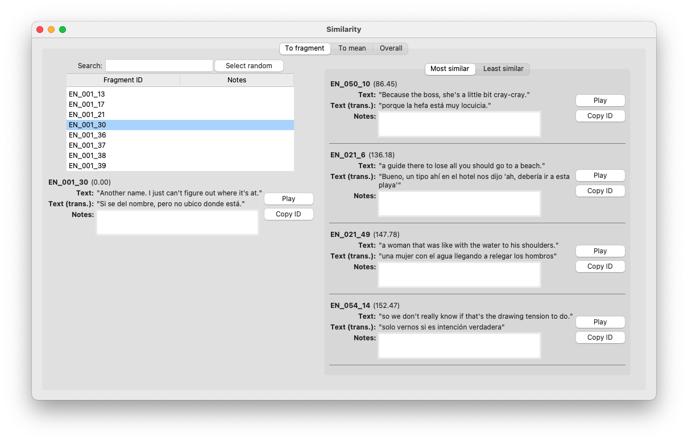

# models

<!-- This directory contains the code for DRAL English and Spanish short conversation fragments
prosodic features mapping models, baselines, metrics, and analysis. -->

(Description of directory contents.)

## Correlation figure: features vs. features

To create these, run `make_feature_corrs_fig.py`. Below is the feature-by-feature correlation figure for English versus Spanish DRAL 4.0 short fragments.

## Correlation figure: features vs. duration

(Image inserted here.)

## Prosody dissimilarity metric
## GUI application

To help in analysis of the similarity measure, I built a "similarity" application. The application consists of three main views: the "To fragment" view, the "To mean" view, and the "Overall" view. The "To fragment" view lets you search for and select a fragment by ID, and then displays the fragments that are most similar and dissimilar according to the similarity measure. Next to a fragment is a button to play its audio and a field to enter notes on observations. This view displays fragments only in the same language, as the models are designed to compare fragments within the same language.

Run `gui_main.py`.

## Test models

1. Prepare the data for feature computation and compute the prosodic features. See the workflow diagram in [DRAL/README.md](../DRAL/README.md).
2. Run `experiments.py`.

## Parse MATLAB PCA outputs

(Description.)

## Models

A description of each ... at top documentation. (Link to each script file in markdown.)

1. linear regression model --> `model_linear_regression.py`
2. k-nearest neighbors regression --> `model_knn.py`
3. shallow feed forward neural network
4. naive baseline
5. synthesis baseline